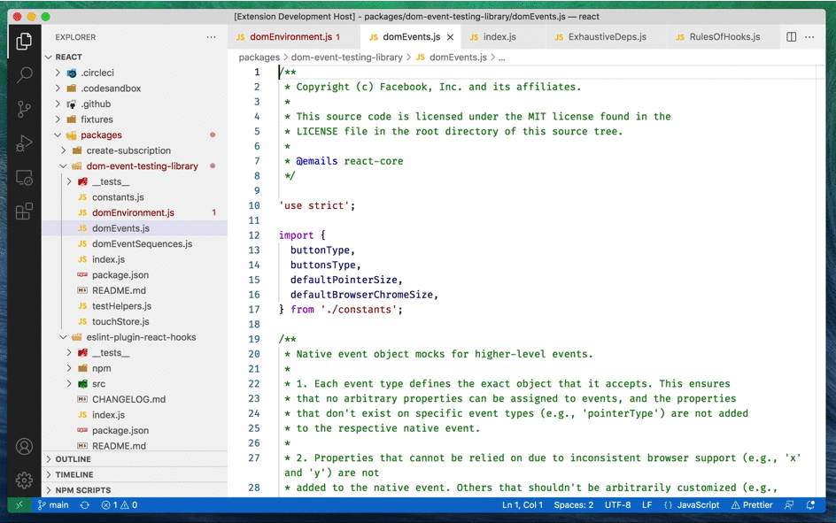

# VSCode Plugin Recent Picker

This plugin allows you to view and pick the recently opened files.

## Features

This plugin remember filenames, which you opened in text editors and show last 30 (configurable) of items in picker.



## Extension Settings

### Mac

Default configuration of hotkeys:

```json
{
    "key": "cmd+e",
    "command": "recent-picker.open"
}
```

### Windows

```json
{
    "key": "ctrl+e",
    "command": "recent-picker.open"
}
```
